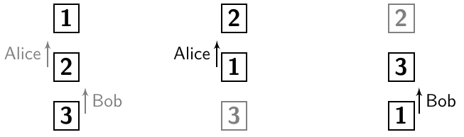
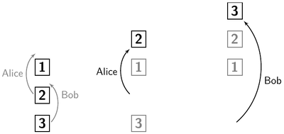
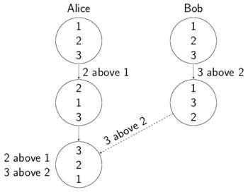

# Vertical Move
This document describes how the vertical move operation works.
It changes the order of elements in an ordered list.

## Desired merge results
Vertical move operations can be modeled in several ways:

#### Decrease index
A vertical move operation can be modeled by defining, that the index of a specific element should be decreased.

Example:
* Alice: VerticalMove(2, up)
* Bob: VerticalMove(3, up)

When Alice's operation is applied to the list in the first column of the graphic, the result is the list in the second column. The index of element 2 was decreased by one and therefore the index of element 1 increased. When Bob's operation is applied then, the result is the list in the third column:



When however Bob's operation is applied to the list `1, 2, 3` and then Alice's operation, the result will be `1, 2, 3`, so the order will be the same as in the original list.

Conclusion: When applying operations, the order matters.

#### Provide a target
A vertical move operation can be modeled by providing a target element, above which the moved element should end up.

Example:
* Alice: VerticalMove(2, above, 1)
* Bob: VerticalMove(3, above, 2)



Here, the two operations can be applied in different order, too. Let's compare their results-

|  | Alice, then Bob: `3, 2, 1` | Bob then Alice: `2, 1, 3` |
| --- | --- | --- |
| Is `2` above `1` ?  | ✓ | ✓ |
| Is `3` above `2` ? | ✓ | x |

The table shows, that it's nicer when Alice's operation is applied before Bob's. This is the case, because Bob's target, the `2`, is moved with Alice's operation.

#### Ordering operations
To always have a nice result for concurrent operations which provide a target, let's deviate a rule:
> When the target element of an operation is moved in a concurrent operation, the the concurrent operation should be done first.

Let's apply the rule to the example:

* Alice: VerticalMove(2, above, 1)
* Bob: VerticalMove(3, above, 2)

Dependencies of Alice's operation are operations moving the `1`. There are none. Dependencies of Bob's operation are operations moving the `2`. That's Alice's operation, so do that one first.

When expressing the dependencies for each operation, a topological sort algorithm can be applied to the list of operations. It will output an order in which each operation comes after the operations it depends on.

When moving elements concurrently, user may create dependency cycles like
* Alice: VerticalMove(3, above, 1)
* Bob: VerticalMove(1, above, 3).

These cycles has to be dissolved before applying the topological sort by deleting one of the operations of the cycle.

#### Comparison
Which model for vertical move operations shall we choose? Let's compare the results of the two options:

| | Decrease index: `2, 3, 1` | Provide a target: `3, 2, 1` |
| --- | --- | --- |
| 2 went up | ✓ | x |
| 3 went up | ✓ | ✓ |
| 2 above 1 | o | ✓ |
| 3 above 2 | x | ✓ |

When using the option which decreases the index, both moved elements went up. When using the model which provides a target, just one element moves up. However, when providing a target, both moved elements are above the element now, which was above it in the beginning.

Vertical moving is used for use cases like reordering agenda items or tasks. When a user moves element `3` one up, I assume he wants it above element `2`.  When providing a target, this will be the outcome. But when decreasing the index, it will not. Instead, the `1` moves to the bottom. I think then his intention is lost, since element `3` is not above element `2`.

Therefore I chose the model which provides a target for the implementation.

## Syntax
The method `moveVertical(targetExpr: Expr, beforeAfter: BeforeAfter)` is part of the possible operations for an expression. Expressions are used to construct a cursor to a specific element of the JSON. The method moves that element to a new position in the same list. The new position is described by providing a `targetExpr` which must be a different element in the same list.
Furthermore one can deside wether the element should be moved right before or after the target element by filling the parameter `beforeAfter` with either `Before` or `After`.

Example code:

`two.moveVertical(one, Before))`

Where `one` and `two` are

````
val children = doc.downField("children")
val two = children.iter.next.next
val one = children.iter.next
````

Applying this operation to a list `1, 2, 3` will result in `2, 1, 3`.

More usage examples and tests are in the file [`MoveVertical.scala`](https://github.com/Tamriel/crjdt/blob/master/modules/circe/src/test/scala/eu/timepit/crjdt/circe/MoveVertical.scala).

## Algorithm
The order of a list node is stored inside a `Map[ListRef, ListRef]`, where a ListRef points to the next one. Therefore applying a vertical move operation is as simple as adjusting this map. When two move operations are done concurrently however, the result may differ depending on the order the operations were applied.

To always have the same result, the algorithm resets the order and applies the operation in the same order on all replicas.

Example: Alice and Bob both start with the same list `1, 2, 3`. Both do a vertical move operation. Alice receives Bob's operation:


Alice resets the order of elements to the order when Alice and Bob had the same state:


Then she applies the two operations again, but in a specific order. The result is `3, 2, 1`:



What was just shown in the example can be abstracted into:

When an operation comes in which was done concurrently to an own operation:
1. Reset the current order to the order when the two replicas had the same state.
2. Redo all operations since then in a specific order. The order does not matter, as long as all sides order in the same way and therefore all sides get the same result.

To get a result the users expect, a topological sort can be applied, as outlined above. Though, this is not implement yet.

To be able to reset the order to an older order, the order is saved before applying any operation. It is saved in the Map `orderArchive` inside the parent node with the counter value of the operation id as the key.

How do we now, to which order we shall reset? All concurrent operations have the same counter value inside their id. Therefore we can just reset to the order which has the counter value of the incoming operation as its key. That is the order, which was saved before the local operation of the concurrent operations was applied.

## Performance improvements
To improve performance and save disk space, we don't save the
order before assign operations, since they don't change the order.
Now there might be this situation: Alice did an assign and then a
move op, while Bob did a move op. Now Bob's op comes in and
Alice resets her order to the order with counter value like the
incoming op. However, locally exists no such saved order, since
she has done an assign op at that count. Therefore she resets
to the next higher saved order.

This fix is implemented by getting all orders whose counter is
greater equals than the counter of the incoming op and then
choosing the earliest order of those.

Furthermore, resetting the order and redoing operation must be done for concurrent operations which change the order only. Therefore assign operations can simply be applied.
