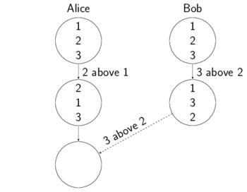
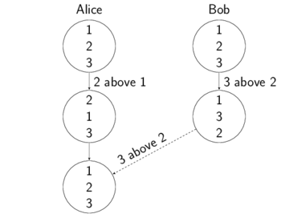

# Vertical Move
This document describes how the vertical move operation works.
It changes the order of elements in an ordered list.

## Syntax
The method `moveVertical(targetExpr: Expr, beforeAfter: BeforeAfter)` is part of the possible operations for an expression. Expressions are used to construct a cursor to a specific element of the JSON. The method moves that element to a new position in the same list. The new position is described by providing a `targetExpr` which must be a different element in the same list.
Furthermore one can deside wether the element should be moved right before or after the target element by filling the parameter `beforeAfter` with either `Before` or `After`.

Example code:

`one.moveVertical(three, After))`

Where `one` and `three` are

````
val children = doc.downField("children")
val one = children.iter.next
val three = children.iter.next.next.next
````

Applying this operation to a list `[1, 2, 3]` will result in `[2, 3, 1]`.

More usage examples and tests are in the file [`MoveVertical.scala`](https://github.com/Tamriel/crjdt/blob/master/modules/circe/src/test/scala/eu/timepit/crjdt/circe/MoveVertical.scala).

## Algorithm
Applying a vertical move operation is as simple as adjusting the next ref list of the parent of the moved element.
It becomes difficult, when two move operations are done concurrently:

Alice and Bob







One is done locally, and when the other one, done by a remote replica comes in,
That order is restored and we redo the two concurrent operations.

When an operation comes in which was done concurrently to an own op:
1. Reset the current order to the order before
2. Redo all operations since then in a specific order. The order does not matter in the first place, as long as all sides order in the same way and therefore all sides get the same result.

To be able to reset the order to an older order, we save the order before applying any operation. It is saved in the Map `orderArchive` inside the parent node with the counter of the operation id as the key.

When resetting the order, we get the order which has the counter of the incoming operation as its id. That is the order which was saved, before the local operation which is concurrent to the incoming operation was applied.

/** Before applying an operation we save the order in orderArchive.
          * It is a Map whose key is the lamport timestamp counter value.
          *
          * To improve performance and save disk space, we don't save the
          * order before assign operations, since they don't change the order.
          * Now there might be this situation: Alice did an assign and then a
          * move op, while Bob did a move op. Now Bobs op comes in and
          * Alice resets her order to the order with counter value like the
          * incoming op. However, locally exists no such saved order, since
          * she has done an assign op at that count. Therefore she resets
          * to the next higher saved order.
          * This fix is implemented by getting all orders whose counter is
          * greater equals than the counter of the incoming op and then
          * choosing the earliest order of those: */


## Desired merge results
Alice: VerticalMove(2, up) \\
Bob: \ VerticalMove(3, up)

Alice: VerticalMove(2, above, 1)
Bob: \ VerticalMove(3, above, 2)

baum use cases


## Performance improvements
